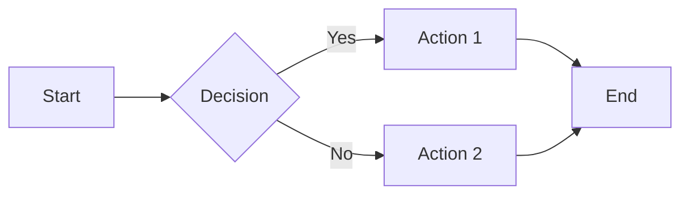

# Create Content: Format Text, Code, Images, Components, and More

A comprehensive guide to creating content in Mintlify, including text formatting, code blocks, images, components, reusable snippets, redirects, and changelogs.

## Format Text

Use standard Markdown syntax for text formatting.

### Basic Formatting

- **Bold**: `**text**` → **text**
- **Italic**: `_text_` → _text_
- **Strikethrough**: `~text~` → ~text~

**Best practices**:
- Use bold for emphasis, not entire paragraphs
- Reserve italics for terms, titles, or subtle emphasis
- Avoid over-formatting that distracts from content

### Combining Formats

You can combine formatting styles:

```markdown
***bold and italic***
**bold and ~strikethrough~**
_italic and ~strikethrough~_
```

### Headings

Use heading hierarchy properly (H1 → H2 → H3):

```markdown
# H1 Heading (from page title in frontmatter)
## H2 Section
### H3 Subsection
#### H4 Sub-subsection
```

**Important**: Each page should have exactly one H1 (defined by `title` in frontmatter). Don't skip heading levels.

### Links

**Internal links** (use root-relative paths):

```markdown
[Quickstart](/quickstart)
[Steps Component](/components/steps)
```

**External links**:

```markdown
[Markdown Guide](https://www.markdownguide.org/)
```

**Best practices**:
- Use descriptive link text instead of "click here"
- Use root-relative paths for internal links
- Test links regularly to prevent broken references

### Blockquotes

```markdown
> This is a blockquote highlighting important information.
```

### Mathematical Expressions

**Inline equations**: Use single dollar signs `$E = mc^2$`

**Block equations**: Use double dollar signs:

```markdown
$$
E = mc^2
$$
```

LaTeX support requires proper mathematical syntax. Configure `styling.latex` in `docs.json` to override automatic detection.

## Format Code

### Inline Code

Use backticks for inline code:

```markdown
Use the `mint dev` command to preview locally.
```

### Code Blocks

Use fenced code blocks with three backticks:

````markdown
```javascript
function hello() {
  console.log("Hello, World!");
}
```
````

### Code Block Options

Add meta options after the language:

````markdown
```java HelloWorld.java example lines icon="java" highlight={1-2,5}
class HelloWorld {
    public static void main(String[] args) {
        System.out.println("Hello, World!");
    }
}
```
````

**Meta options**:
- **Filename**: `HelloWorld.java` - Displayed in header
- **Icon**: `icon="java"` - Icon in header
- **Lines**: `lines` - Show line numbers
- **Highlight**: `highlight={1-2,5}` - Highlight specific lines
- **Wrap**: `wrap` - Enable word wrapping
- **Expandable**: `expandable` - Collapsible code block

### Code Groups

Display multiple code blocks in tabs:

````markdown
<CodeGroup>

```javascript helloWorld.js
console.log("Hello World");
```

```python hello_world.py
print('Hello World!')
```

```java HelloWorld.java
class HelloWorld {
    public static void main(String[] args) {
        System.out.println("Hello, World!");
    }
}
```

</CodeGroup>
````

### Syntax Highlighting

Always specify the programming language for syntax highlighting and accessibility:

````markdown
```javascript
function getUserData(id) {
  return fetch(`/api/users/${id}`);
}
```
````

**Supported**: All languages supported by Shiki. See Shiki documentation for the full list.

## Images and Embeds

### Basic Images

Use Markdown syntax:

```markdown

```

**Requirements**:
- Always include descriptive alt text
- Image files must be less than 20 MB
- For larger files, host on CDN (Amazon S3, Cloudinary)

### HTML Images

For better control, use HTML `` tags:

```html

```

### Light and Dark Mode Images

Display different images for light and dark themes:

```html
<!-- Light mode image -->


<!-- Dark mode image -->

```

### Videos

Embed videos using HTML `<video>` tags:

```html
<video
  controls
  className="w-full rounded-xl"
  poster="/images/video-thumbnail.jpg"
>
  <source src="/videos/tutorial.mp4" type="video/mp4" />
  Your browser does not support the video tag.
</video>
```

Always include fallback text for browsers that don't support video playback.

### YouTube Embeds

Embed YouTube videos with iframes:

```html
<iframe
  className="w-full aspect-video rounded-xl"
  src="https://www.youtube.com/embed/4KzFe50RQkQ"
  title="Tutorial: Setting up your first documentation site"
  allow="accelerometer; autoplay; clipboard-write; encrypted-media; gyroscope; picture-in-picture"
  allowFullScreen
></iframe>
```

### Iframes

Embed external content:

```html
<iframe
  src="https://example.com/embed"
  title="Embedded content description"
  className="w-full h-96 rounded-xl"
></iframe>
```

**Accessibility**: Always include descriptive `title` attributes for iframes and video embeds.

## Files

Mintlify automatically serves static assets from your repository.

### File Organization

Organize files using folders:

```
/your-project
  |- docs.json
  |- images/
    |- logo.png
    |- screenshots/
      |- dashboard.png
  |- assets/
    |- whitepaper.pdf
    |- demo-video.mp4
```

### File Access

Files are accessible at their repository path:

- Repository: `/images/my-logo.png`
- URL: `https://docs.your-project.com/images/my-logo.png`

### File Size Limits

- **Images**: Less than 20 MB
- **Other files**: Less than 100 MB

### File Serving Restrictions

File serving is **not supported** for documentation sites with authentication enabled. Static files won't be accessible at direct URLs when authentication is required.

## Lists and Tables

### Unordered Lists

Use dashes, asterisks, or plus signs:

```markdown
- First item
- Second item
- Third item
```

Or:

```markdown
* First item
* Second item
* Third item
```

### Ordered Lists

Use numbers followed by periods:

```markdown
1. First item
2. Second item
3. Third item
```

### Nested Lists

```markdown
- First level
  - Second level
    - Third level
- Back to first level
```

### Tables

Follow standard Markdown table syntax:

```markdown
| Property | Description |
|----------|-------------|
| Name     | Full name of the user |
| Age      | User's age |
| Active   | Whether user has joined |
```

**Alignment**:

```markdown
| Left | Center | Right |
|:-----|:------:|------:|
| Left | Center | Right |
```

## Components

Mintlify provides interactive components to enhance your documentation.

### Callouts

Highlight important information:

```markdown
<Note>
This adds a note in the content.
</Note>

<Warning>
This raises a warning to watch out for.
</Warning>

<Info>
This draws attention to important information.
</Info>

<Tip>
This suggests a helpful tip.
</Tip>

<Check>
This brings us a checked status.
</Check>

<Danger>
This is a danger callout.
</Danger>
```

**Custom callout**:

```markdown
<Callout icon="key" color="#FFC107" iconType="regular">
This is a custom callout
</Callout>
```

### Accordions

Show and hide content sections:

```markdown
<Accordion title="I am an Accordion.">
  You can put any content here, including other components, like code:

  ```java HelloWorld.java
  class HelloWorld {
      public static void main(String[] args) {
          System.out.println("Hello, World!");
      }
  }
  ```
</Accordion>
```

**Accordion Groups**:

```markdown
<AccordionGroup>
  <Accordion title="First Accordion">
    Content for first accordion.
  </Accordion>
  <Accordion title="Second Accordion">
    Content for second accordion.
  </Accordion>
</AccordionGroup>
```

### Tabs

Organize content into multiple panels:

```markdown
<Tabs>
  <Tab title="First tab">
    Content for the first tab.

    You can add any components inside tabs.
  </Tab>
  <Tab title="Second tab" icon="leaf">
    Content for the second tab.

    This one has an <Icon icon="leaf" /> icon!
  </Tab>
  <Tab title="Third tab">
    Content for the third tab.
  </Tab>
</Tabs>
```

### Cards

Create visual containers for content:

```markdown
<Card title="Card Title" icon="rocket">
  Card content goes here.
</Card>
```

**Link cards**:

```markdown
<Card
  title="Link card"
  icon="link"
  href="/components/columns"
  arrow="true"
  cta="Click here"
>
  This card links to another page.
</Card>
```

**Grouping cards**:

```markdown
<Columns cols={2}>
  <Card title="First card" icon="panel-left-close">
    This is the first card.
  </Card>
  <Card title="Second card" icon="panel-right-close">
    This is the second card.
  </Card>
</Columns>
```

### Steps

Display sequential actions:

```markdown
<Steps>
  <Step title="First Step">
    Instructions for the first step.
  </Step>
  <Step title="Second Step">
    Instructions for the second step.
  </Step>
  <Step title="Third Step">
    Instructions for the third step.
  </Step>
</Steps>
```

**Custom title size**:

```markdown
<Steps titleSize="h2">
  <Step title="Step with H2 title">
    Content here.
  </Step>
</Steps>
```

### Mermaid Diagrams

Create flowcharts, sequence diagrams, and more:

````markdown

````

See Mermaid documentation for complete syntax and diagram types.

## Reusable Snippets

Create reusable content to maintain consistency across pages.

### JSX Snippets

Create React components in the `snippets` folder:

**`snippets/my-component.jsx`**:

```jsx
export const MyComponent = () => {
  return (
    <div>
      <h1>Hello, world!</h1>
    </div>
  );
};
```

**Important**: Use arrow function syntax (`=>`), not `function` declarations.

**Import and use**:

```mdx
---
title: "My Page"
---

import { MyComponent } from '/snippets/my-component.jsx';

<MyComponent />
```

### Variables

Export variables from snippet files:

**`snippets/variables.mdx`**:

```markdown
export const myName = "John Doe";
export const myObject = {
  fruit: "apple",
  color: "red"
};
```

**Use in pages**:

```mdx
---
title: "My Page"
---

import { myName, myObject } from '/snippets/variables.mdx';

Hello, my name is {myName} and I like {myObject.fruit}.
```

### Snippets with Props

Create snippets that accept props:

**`snippets/greeting.jsx`**:

```jsx
export const Greeting = ({ name }) => {
  return <p>Hello, {name}!</p>;
};
```

**Use with props**:

```mdx
<Greeting name="World" />
```

## Redirects

Set up 301 redirects for moved, renamed, or deleted pages.

### Basic Redirects

Add to `docs.json`:

```json
{
  "redirects": [
    {
      "source": "/old-path",
      "destination": "/new-path"
    }
  ]
}
```

### Wildcard Redirects

Use `*` after a parameter for wildcard matching:

```json
{
  "redirects": [
    {
      "source": "/beta/:slug*",
      "destination": "/v2/:slug*"
    }
  ]
}
```

This redirects `/beta/introduction` to `/v2/introduction`.

### Find Broken Links

Use the CLI to detect broken internal links:

```bash
mint broken-links
```

The CLI identifies any relative links in your docs that don't exist.

## Changelogs

Create product changelogs with RSS feed support.

### Setup

1. **Create a changelog page** (e.g., `changelog.mdx`)

2. **Add to navigation** in `docs.json`

3. **Add Update components**:

```markdown
---
title: "Changelog"
rss: true
---

<Update title="v0.1.1" date="2024-01-15">
  ## New Features

  - Added dark mode support
  - Improved search functionality

  ## Bug Fixes

  - Fixed navigation issue on mobile
</Update>

<Update title="v0.1.0" date="2024-01-01">
  Initial release with core features.
</Update>
```

### RSS Feed

Using `<Update>` components automatically creates an RSS feed at:

```
https://your-docs.com/changelog/rss.xml
```

**RSS feed features**:
- Entries added when new `<Update>` components are published
- Top-level headings become RSS entry titles
- Entries link to heading anchors in your docs
- Integrate with Slack, email, or Discord bots

**Enable RSS icon**: Add `rss: true` to page frontmatter to display an RSS button.

### Tag Filters

Add tags to Update components for filtering:

```markdown
<Update title="v0.1.1" tags={["feature", "bugfix"]}>
  Content here.
</Update>
```

Tag filters replace the table of contents on changelog pages.

## Best Practices

1. **Text formatting**: Use formatting sparingly for emphasis
2. **Code blocks**: Always specify the language for syntax highlighting
3. **Images**: Include descriptive alt text for accessibility
4. **Links**: Use descriptive link text, not "click here"
5. **Headings**: Maintain proper hierarchy (H1 → H2 → H3)
6. **Components**: Use components to enhance readability and interactivity
7. **Snippets**: Create reusable snippets for repeated content
8. **Redirects**: Set up redirects when restructuring documentation
9. **Changelogs**: Keep changelogs updated with clear, concise entries
10. **Accessibility**: Ensure all content is accessible (alt text, descriptive links, proper headings)

## Content Checklist

- [ ] Proper heading hierarchy (no skipped levels)
- [ ] Descriptive alt text for all images
- [ ] Language specified for all code blocks
- [ ] Descriptive link text (not "click here")
- [ ] Internal links use root-relative paths
- [ ] Tables properly formatted with alignment
- [ ] Components used appropriately for content type
- [ ] Reusable snippets created for repeated content
- [ ] Redirects configured for moved pages
- [ ] Changelog entries clear and concise
