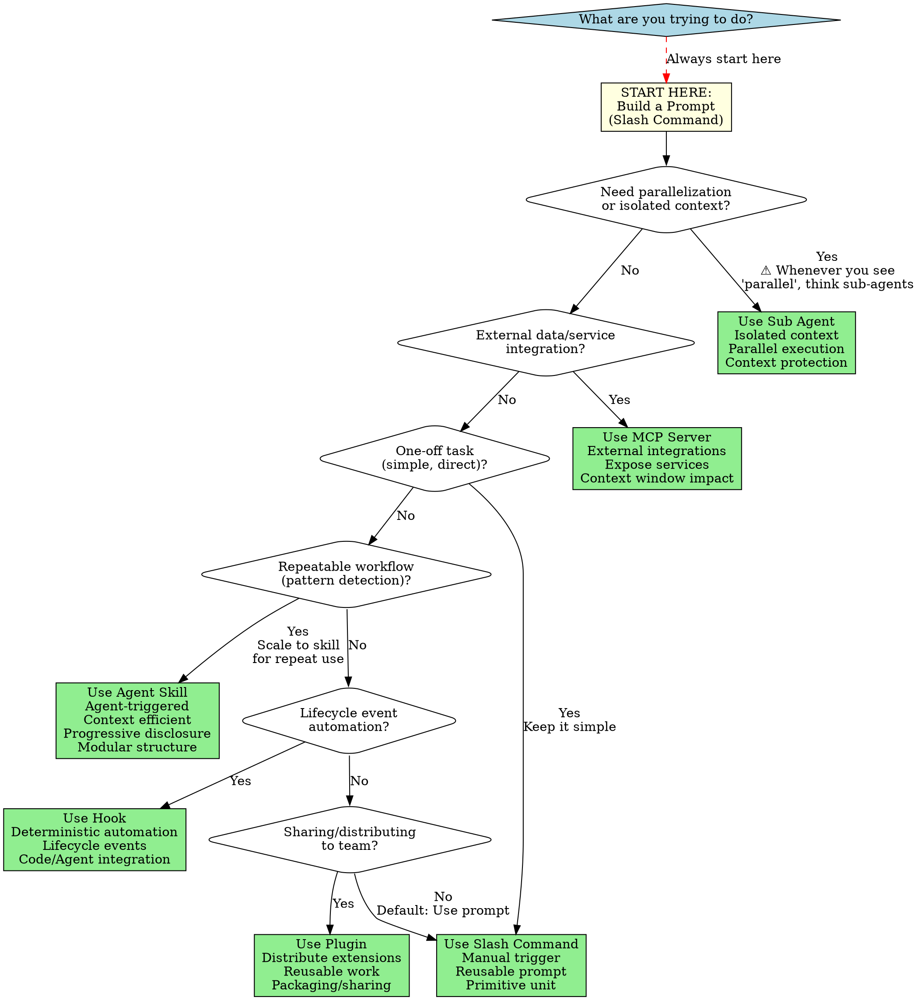

# Claude Code Agent Features - Mermaid Mindmap

This mindmap visualizes the complete structure of Claude Code agent features, their relationships, use cases, and best practices.

**Source:** Extracted from `mindmap-2025-11-05T03-41-12-865Z.svg` and structured in `mindmap-structure.md`

## How to Use This Guide

- **New to Claude Code?** Start with "The Core 4 Thinking Framework"
- **Choosing a component?** Use the "Decision Tree"
- **Understanding architecture?** Study the "Mindmap"
- **Quick reference?** Check the "Decision Matrix"

```mermaid
mindmap
  root((Cloud Code Agent Features))
    Core Agentic Elements
      The Core 4 Thinking Framework
        Context: What information?
        Model: What capability?
        Prompt: What instruction?
        Tools: What actions?
      Context
      Model
      Prompt
      Tools
    Key Components
      Agent Skills
        Capabilities
          Triggered by Agents
          Context Efficient
          Progressive Disclosure
          Modular Directory Structure
          Composability w/ Features
          Dedicated Solutions
        Pros
          Agent-Initiated Automation
          Context Window Protection
          Logical Organization/File Structure
          Feature Composition Ability
          Agentic Approach
        Cons
          Cannot Nest Sub Agents/Prompts
          Reliability in Complex Chains
          Limited Innovation Over Prompts
          Not Replacement for Other Features
        Examples
          Meta Skill
          Video Processor Skill
          Work Tree Manager Skill
        Author Assessment
          Rating: 8/10
          Not a replacement for other features
          Higher compositional level
          Thin opinionated file structure
      MCP Servers
        External Integrations
        Expose Services to Agent
        Context Window Impact
      Sub Agents
        Isolated Workflows
        Context Protection
        Parallelization Support
      Custom Slash Commands
        Manual Triggers
        Reusable Prompt Shortcuts
        Primitive Unit (Prompt)
      Hooks
        Deterministic Automation
        Executes on Lifecycle Events
        Code/Agent Integration
      Plugins
        Distribute Extensions
        Reusable Work
      Output Styles
        Customizable Output
        Examples
          text-to-speech
          diff
          summary
    Use Case Examples
      Automatic PDF Text Extraction → Agent Skill
      Connect to Jira → MCP Server
      Security Audit → Sub Agent
      Git Commit Messages → Slash Command
      Database Queries → MCP Server
      Fix & Debug Tests → Sub Agent
      Detect Style Guide Violations → Agent Skill
      Fetch Real-Time Weather → MCP Server
      Create UI Component → Slash Command
      Parallel Workflow Tasks → Sub Agent
    Proper Usage Patterns
      CRITICAL: Prompts Are THE Primitive
        Everything is prompts (tokens in/out)
        Master this FIRST (non-negotiable)
        Don't convert all slash commands to skills
        Core building block for all components
      When To Use Each Feature
        Start Simple With Prompts
        Scaling to Skill (Repeat Use)
        Skill As Solution Manager
      Compositional Hierarchy
        Skills: Top Compositional Layer
        Composition Examples
        Circular Composition Limits
      Agentic Composability Advice
        Context considerations
        Model selection
        Prompt design
        Tool integration
    Common Anti-Patterns
      Converting all slash commands to skills (HUGE MISTAKE)
      Using skills for one-off tasks
      Forgetting prompts are the foundation
      Not mastering prompts first
    Best Practices & Recommendations
      Auto-Organize workflows
      Leverage progressive disclosure
      Maintain clear boundaries between components
      Use appropriate abstraction levels
    Capabilities Breakdown
      Detailed analysis of each component's capabilities and limitations
    Key Insights
      Hierarchical Understanding
        Prompts = Primitive foundation
        Slash Commands = Reusable prompts
        Sub-Agents = Isolated execution contexts
        MCP Servers = External integrations
        Skills = Top-level orchestration layer
        Hooks = Lifecycle automation
        Plugins = Distribution mechanism
        Output Styles = Presentation layer
      Critical Distinctions
        Skills cannot nest sub-agents/prompts
        Prompts are the fundamental primitive
        Skills are compositional layers, not replacements
        Context efficiency matters
        Reliability in complex chains needs attention
      Decision Framework
        Repeatable pattern detection → Agent Skill
        External data/service access → MCP Server
        Parallel/isolated work → Sub Agent
        Parallel workflow tasks → Sub Agent (whenever you see parallel, think sub-agents)
        One-off task → Slash Command
        Lifecycle automation → Hook
        Team distribution → Plugin
      Composition Model
        Skills Orchestration Layer
          Can compose: Prompts, MCP Servers, Sub-Agents, Other Skills
          Cannot nest: Skills within Skills (circular limit)
          Purpose: Domain-specific workflows
        Sub-Agents Execution Layer
          Isolated contexts
          Parallel execution
          Cannot nest: Sub-agents within sub-agents
        Slash Commands Primitive Layer
          Manual invocation
          Reusable prompts
          Can be composed into higher layers
        MCP Servers Integration Layer
          External connections
          Expose services to all components
```

## Additional Notes

### Composition Hierarchy

The mindmap shows a clear composition hierarchy:

1. **Prompts** = Primitive foundation (everything builds on this)
2. **Slash Commands** = Reusable prompts
3. **Sub-Agents** = Isolated execution contexts
4. **MCP Servers** = External integrations
5. **Skills** = Top-level orchestration layer
6. **Hooks** = Lifecycle automation
7. **Plugins** = Distribution mechanism
8. **Output Styles** = Presentation layer

### Decision Matrix

| Task Type | Component | Reason |
|-----------|-----------|---------|
| Repeatable pattern detection | Agent Skill | Domain-specific workflow |
| External data/service access | MCP Server | Integration point |
| Parallel/isolated work | Sub Agent | Context isolation |
| Parallel workflow tasks | Sub Agent | **Whenever you see parallel, think sub-agents** |
| One-off task | Slash Command | Simple, direct |
| Lifecycle automation | Hook | Event-driven |
| Team distribution | Plugin | Packaging |

### Critical Principles

- **⚠️ CRITICAL: Prompts are THE fundamental primitive** - Everything is prompts (tokens in/out). Master this FIRST (non-negotiable). Don't convert all slash commands to skills.
- **Skills cannot nest sub-agents/prompts** (explicit limitation)
- **Skills are compositional layers, not replacements** (complementary, not substitutes). Rating: 8/10 - "Higher compositional level" not a replacement.
- **Skills CAN use other Skills** (but cannot nest them circularly)
- **Context efficiency matters** (progressive disclosure, isolation)
- **Reliability in complex chains needs attention** (acknowledged challenge)
- **Parallel keyword = Sub Agents** - Whenever you see parallel, think sub-agents

### Common Anti-Patterns to Avoid

- **Converting all slash commands to skills** - This is a HUGE MISTAKE. Skills are for repeatable workflows, not one-off tasks.
- **Using skills for one-off tasks** - Use slash commands (prompts) instead.
- **Forgetting prompts are the foundation** - Master prompts first before building skills.
- **Not mastering prompts first** - If you avoid understanding prompts, you will not progress as an agentic engineer.

### The Core 4 Thinking Framework

Every agent is built on these four fundamental pieces:

1. **Context** - What information does the agent have access to?
2. **Model** - What capabilities does the model provide?
3. **Prompt** - What instruction are you giving?
4. **Tools** - What actions can the agent take?

If you understand these four elements, you can master any agentic feature or tool. This is the foundation - if you master the fundamentals, you'll master the compositional units, features, and tools.

## Decision Tree: When to Use What

This decision tree helps you choose the right Claude Code component based on your needs. **Always start with prompts** - master the primitive first!

### Decision Tree Key Points

**Critical Rule**: Always start with **Prompts** (implemented as Slash Commands). Master the primitive first before scaling to other components.

**Decision Flow**:

1. **Parallel/Isolated?** → Sub Agent (whenever you see "parallel", think sub-agents)
2. **External Integration?** → MCP Server
3. **One-off Task?** → Slash Command (keep it simple)
4. **Repeatable Pattern?** → Agent Skill (scale up)
5. **Lifecycle Automation?** → Hook
6. **Team Distribution?** → Plugin
7. **Default** → Slash Command (prompt)

**Remember**: Skills are compositional layers, not replacements. Don't convert all your slash commands to skills - that's a HUGE MISTAKE!

**Important Composition Rules**:

- **Sub Agents** cannot nest other sub agents
- **Skills** can compose prompts, MCPs, sub-agents, and other skills (but cannot nest them circularly)
- **Slash Commands** can be composed into higher layers (skills, sub-agents)
- **MCP Servers** expose services to all components but are lower-level units
