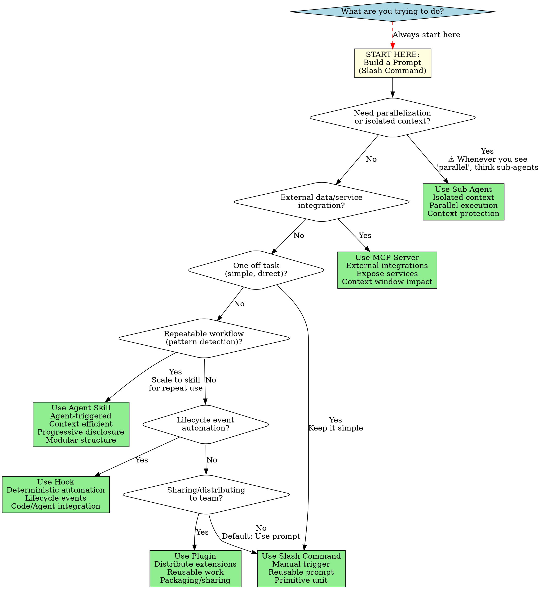

# Claude Code Agent Features - Comprehensive Guide

This document visualizes the complete structure of Claude Code agent features, their relationships, use cases, and best practices.

---

## How to Use This Guide

- **New to Claude Code?** Start with "The Core 4 Thinking Framework"
- **Choosing a component?** Use the "Decision Tree"
- **Understanding architecture?** Study the "Mindmap"
- **Quick reference?** Check the "Decision Matrix"

---

## Terminology

Understanding these terms is critical for navigating Claude Code's composition model:

- **Use** - Invoke a single component for a task (e.g., calling a slash command)
- **Compose** - Wire multiple components together into a larger workflow (e.g., a skill that orchestrates prompts, sub-agents, and MCPs)
- **Nest** - Hierarchical containment (placing one capability inside another's scope)
  - **Hard Limit:** Sub-agents cannot nest other sub-agents (technical restriction)
  - **Allowed:** Skills can compose/use sub-agents, prompts, MCPs, and other skills

---

## The Core 4 Thinking Framework

Every agent is built on these four fundamental pieces:

1. **Context** - What information does the agent have access to?
2. **Model** - What capabilities does the model provide?
3. **Prompt** - What instruction are you giving?
4. **Tools** - What actions can the agent take?

**Master these fundamentals first.** If you understand these four elements, you can master any agentic feature or tool. This is the foundation - everything else builds on top of this.

---

## Component Overview Mindmap

```mermaid
mindmap
  root((Claude Code Agent Features))
    Core Agentic Elements
      The Core 4 Thinking Framework
        Context: What information?
        Model: What capability?
        Prompt: What instruction?
        Tools: What actions?
      Context
      Model
      Prompt
      Tools
    Key Components
      Agent Skills
        Capabilities
          Triggered by Agents
          Context Efficient
          Progressive Disclosure
          Modular Directory Structure
          Composability w/ Features
          Dedicated Solutions
        Pros
          Agent-Initiated Automation
          Context Window Protection
          Logical Organization/File Structure
          Feature Composition Ability
          Agentic Approach
        Cons
          Subject to sub-agent nesting limitation
          Reliability in complex chains needs attention
          Not a replacement for other features
        Examples
          Meta Skill
          Video Processor Skill
          Work Tree Manager Skill
        Author Assessment
          Rating: 8/10
          Not a replacement for other features
          Higher compositional level
          Thin opinionated file structure
      MCP Servers
        External Integrations
        Expose Services to Agent
        Context Window Impact
      Sub Agents
        Isolated Workflows
        Context Protection
        Parallelization Support
        Cannot nest other sub-agents
      Custom Slash Commands
        Manual Triggers
        Reusable Prompt Shortcuts
        Primitive Unit (Prompt)
      Hooks
        Deterministic Automation
        Executes on Lifecycle Events
        Code/Agent Integration
      Plugins
        Distribute Extensions
        Reusable Work
      Output Styles
        Customizable Output
        Examples
          text-to-speech
          diff
          summary
    Use Case Examples
      Automatic PDF Text Extraction → Agent Skill
      Connect to Jira → MCP Server
      Security Audit → Sub Agent
      Git Commit Messages → Slash Command
      Database Queries → MCP Server
      Fix & Debug Tests → Sub Agent
      Detect Style Guide Violations → Agent Skill
      Fetch Real-Time Weather → MCP Server
      Create UI Component → Slash Command
      Parallel Workflow Tasks → Sub Agent
    Proper Usage Patterns
      CRITICAL: Prompts Are THE Primitive
        Everything is prompts (tokens in/out)
        Master this FIRST (non-negotiable)
        Don't convert all slash commands to skills
        Core building block for all components
      When To Use Each Feature
        Start Simple With Prompts
        Scaling to Skill (Repeat Use)
        Skill As Solution Manager
      Compositional Hierarchy
        Skills: Top Compositional Layer
        Composition Examples
        Technical Limits
      Agentic Composability Advice
        Context considerations
        Model selection
        Prompt design
        Tool integration
    Common Anti-Patterns
      Converting all slash commands to skills (HUGE MISTAKE)
      Using skills for one-off tasks
      Forgetting prompts are the foundation
      Not mastering prompts first
    Best Practices & Recommendations
      Auto-Organize workflows
      Leverage progressive disclosure
      Maintain clear boundaries between components
      Use appropriate abstraction levels
    Capabilities Breakdown
      Detailed analysis of each component's capabilities and limitations
    Key Insights
      Hierarchical Understanding
        Prompts = Primitive foundation
        Slash Commands = Reusable prompts
        Sub-Agents = Isolated execution contexts
        MCP Servers = External integrations
        Skills = Top-level orchestration layer
        Hooks = Lifecycle automation
        Plugins = Distribution mechanism
        Output Styles = Presentation layer
      Critical Distinctions
        Sub-agents cannot nest other sub-agents (hard limit)
        Skills can compose sub-agents, prompts, MCPs, other skills
        Prompts are the fundamental primitive
        Skills are compositional layers, not replacements
        Context efficiency matters
        Reliability in complex chains needs attention
      Decision Framework
        Repeatable pattern detection → Agent Skill
        External data/service access → MCP Server
        Parallel/isolated work → Sub Agent
        Parallel workflow tasks → Sub Agent (whenever you see parallel, think sub-agents)
        One-off task → Slash Command
        Lifecycle automation → Hook
        Team distribution → Plugin
      Composition Model
        Skills Orchestration Layer
          Can compose: Prompts/Slash Commands, MCP Servers, Sub-Agents, Other Skills
          Restriction: Avoid circular dependencies (skill A → skill B → skill A)
          Purpose: Domain-specific workflow orchestration
        Sub-Agents Execution Layer
          Can compose: Prompts, MCP Servers
          Cannot nest: Sub-agents within sub-agents (hard technical limitation)
          Purpose: Isolated/parallel task execution
        Slash Commands Primitive Layer
          Manual invocation
          Reusable prompts
          Can be composed into higher layers
        MCP Servers Integration Layer
          External connections
          Expose services to all components
```

---

## Composition Hierarchy

The mindmap shows a clear composition hierarchy:

1. **Prompts** = Primitive foundation (everything builds on this)
2. **Slash Commands** = Reusable prompts
3. **Sub-Agents** = Isolated execution contexts
4. **MCP Servers** = External integrations
5. **Skills** = Top-level orchestration layer
6. **Hooks** = Lifecycle automation
7. **Plugins** = Distribution mechanism
8. **Output Styles** = Presentation layer

### Verified Composition Capabilities

**Skills can compose:**

- ✅ Prompts/Slash Commands
- ✅ MCP Servers
- ✅ Sub-Agents
- ✅ Other Skills (avoid circular dependencies)

**Sub-Agents can compose:**

- ✅ Prompts
- ✅ MCP Servers
- ❌ Other Sub-Agents (hard technical limitation - verified in official docs)

**Technical Limit (Verified):**

- Sub-agents **cannot nest other sub-agents** (this prevents infinite recursion)
- This is the only hard nesting restriction in the system

---

## Decision Matrix

| Task Type | Component | Reason |
|-----------|-----------|---------|
| Repeatable pattern detection | Agent Skill | Domain-specific workflow |
| External data/service access | MCP Server | Integration point |
| Parallel/isolated work | Sub Agent | Context isolation |
| Parallel workflow tasks | Sub Agent | **Whenever you see parallel, think sub-agents** |
| One-off task | Slash Command | Simple, direct |
| Lifecycle automation | Hook | Event-driven |
| Team distribution | Plugin | Packaging |

---

## Decision Tree: When to Use What

This decision tree helps you choose the right Claude Code component based on your needs. **Always start with prompts** - master the primitive first!

### Decision Tree Key Points

**Critical Rule**: Always start with **Prompts** (implemented as Slash Commands). Master the primitive first before scaling to other components.

**Decision Flow**:

1. **Parallel/Isolated?** → Sub Agent (whenever you see "parallel", think sub-agents)
2. **External Integration?** → MCP Server
3. **One-off Task?** → Slash Command (keep it simple)
4. **Repeatable Pattern?** → Agent Skill (scale up)
5. **Lifecycle Automation?** → Hook
6. **Team Distribution?** → Plugin
7. **Default** → Slash Command (prompt)

**Remember**: Skills are compositional layers, not replacements. Don't convert all your slash commands to skills - that's a HUGE MISTAKE!

---

## Critical Principles

- **⚠️ CRITICAL: Prompts are THE fundamental primitive** - Everything is prompts (tokens in/out). Master this FIRST (non-negotiable). Don't convert all slash commands to skills.
- **Sub-agents cannot nest other sub-agents** (hard technical limitation - verified in official docs)
- **Skills CAN compose sub-agents, prompts, MCPs, and other skills** (verified through first-hand experience)
- **Skills are compositional layers, not replacements** (complementary, not substitutes). Rating: 8/10 - "Higher compositional level" not a replacement.
- **Context efficiency matters** (progressive disclosure, isolation)
- **Reliability in complex chains needs attention** (acknowledged challenge)
- **Parallel keyword = Sub Agents** - Whenever you see parallel, think sub-agents

---

## Verified Composition Rules

Based on official documentation and empirical testing:

### Skills (Top Orchestration Layer)

- ✅ **Can invoke/compose:** Prompts/Slash Commands, MCP Servers, Sub-Agents, Other Skills
- ⚠️ **Best Practice:** Avoid circular dependencies (skill A → skill B → skill A)
- ℹ️ **Purpose:** Domain-specific workflow orchestration
- ℹ️ **When to use:** Repeatable workflows that benefit from automatic triggering

### Sub-Agents (Execution Layer)

- ✅ **Can invoke/compose:** Prompts, MCP Servers
- ❌ **Cannot nest:** Other sub-agents (hard technical limitation from official docs)
- ℹ️ **Purpose:** Isolated/parallel task execution with separate context
- ℹ️ **When to use:** Parallel work, context isolation, specialized roles

### Slash Commands (Primitive Layer)

- ✅ **Can be composed into:** Skills, Sub-Agents
- ℹ️ **Purpose:** Manual invocation of reusable prompts
- ℹ️ **When to use:** One-off tasks, simple workflows, building blocks

### MCP Servers (Integration Layer)

- ✅ **Can be used by:** Skills, Sub-Agents, Main Agent
- ℹ️ **Purpose:** External service/data integration
- ℹ️ **When to use:** Need to access external APIs, databases, or services

---

## Common Anti-Patterns to Avoid

- **Converting all slash commands to skills** - This is a HUGE MISTAKE. Skills are for repeatable workflows, not one-off tasks.
- **Using skills for one-off tasks** - Use slash commands (prompts) instead.
- **Forgetting prompts are the foundation** - Master prompts first before building skills.
- **Not mastering prompts first** - If you avoid understanding prompts, you will not progress as an agentic engineer.
- **Trying to nest sub-agents** - This is a hard technical limitation and will fail.

---

## Best Practices

### When to Use Each Component

**Start with Prompts:**

- Begin every workflow as a prompt/slash command
- Test and validate the approach
- Only promote to skill when pattern repeats

**Scale to Skills:**

- Pattern used multiple times? → Create a skill
- Need automatic triggering? → Create a skill
- Complex multi-step workflow? → Create a skill
- One-off task? → Keep as slash command

**Use Sub-Agents for:**

- Parallel execution needs
- Context isolation required
- Specialized roles with separate context
- Research or planning phases

**Use MCP Servers for:**

- External API integration
- Database access
- Third-party service connections

---

## Detailed Component Analysis

### Agent Skills

**Capabilities:**

- Triggered automatically by agents based on description matching
- Context efficient through progressive disclosure
- Modular directory structure (SKILL.md, scripts/, references/, assets/)
- Can compose with all other features

**Pros:**

- Agent-initiated automation (no manual invocation needed)
- Context window protection (progressive disclosure)
- Logical organization and file structure
- Feature composition ability
- Scales from simple to complex

**Cons:**

- Subject to sub-agent nesting limitation (composed sub-agents can't nest others)
- Reliability in complex chains needs attention
- Not a replacement for other features (complementary)

**When to Use:**

- Repeatable workflows
- Domain-specific expertise
- Complex multi-step processes
- When you want automatic triggering

**Examples:**

- PDF processing workflows
- Code generation patterns
- Documentation generation
- Brand guidelines enforcement

### Sub-Agents

**Capabilities:**

- Isolated execution context (separate from main agent)
- Can run in parallel
- Custom system prompts
- Tool access (can inherit or specify)
- Access to MCP servers

**Pros:**

- Context isolation
- Parallel execution
- Specialized expertise
- Separate tool permissions

**Cons:**

- Cannot nest other sub-agents (hard limit)
- No memory between invocations
- Need to re-gather context each time

**When to Use:**

- Parallel workflow tasks
- Isolated research/planning
- Specialized roles (architect, tester, reviewer)
- When you need separate context

**Technical Note:**

- **VERIFIED:** Sub-agents cannot spawn other sub-agents (official docs)
- This prevents infinite nesting and maintains system stability

### MCP Servers

**Capabilities:**

- External service integration
- Standardized protocol
- Authentication handling
- Available to all components

**When to Use:**

- Need external data
- API access required
- Database queries
- Third-party service integration

### Slash Commands

**Capabilities:**

- Manual invocation
- Reusable prompts
- Project or global scope
- Can be composed into skills and sub-agents

**When to Use:**

- One-off tasks
- Simple workflows
- Testing new patterns
- Building blocks for skills

### Hooks

**Capabilities:**

- Lifecycle event automation
- Deterministic execution
- Code/agent integration

**When to Use:**

- Pre/post command execution
- File change reactions
- Environment validation

### Plugins

**Capabilities:**

- Bundle multiple components
- Distribution mechanism
- Team sharing

**When to Use:**

- Sharing complete workflows
- Team standardization
- Marketplace distribution

---

## Composition Examples

### Example 1: Full-Stack Development Skill

A skill that orchestrates:

- Calls planning sub-agent (for architecture)
- Calls coding sub-agent (for implementation)
- Uses MCP server (for database queries)
- Invokes testing slash command (for validation)

**This is valid** because:

- Skill composes sub-agents ✓
- Skill composes MCP servers ✓
- Skill composes slash commands ✓
- Sub-agents don't nest each other ✓

### Example 2: Research Workflow

A skill that:

- Calls research sub-agent #1 (searches documentation)
- Calls research sub-agent #2 (analyzes codebase)
- Both run in parallel
- Both use MCP server for external docs

**This is valid** because:

- Skill orchestrates multiple sub-agents ✓
- Sub-agents run in parallel (separate contexts) ✓
- Sub-agents don't nest each other ✓

### Example 3: INVALID - Nested Sub-Agents

A sub-agent that tries to:

- ❌ Call another sub-agent from within itself

**This will FAIL** because:

- Sub-agents cannot nest other sub-agents (hard limit)

---

## Key Insights Summary

### Hierarchical Understanding

1. **Prompts** = Primitive foundation (everything builds on this)
2. **Slash Commands** = Reusable prompts with manual invocation
3. **Sub-Agents** = Isolated execution contexts with separate context windows
4. **MCP Servers** = External integrations available to all
5. **Skills** = Top-level orchestration layer (composes everything)
6. **Hooks** = Lifecycle automation
7. **Plugins** = Distribution mechanism
8. **Output Styles** = Presentation layer

### Critical Technical Facts

**Verified from Official Docs:**

- ✅ Sub-agents CANNOT nest other sub-agents (hard technical limitation)

**Verified from First-Hand Experience:**

- ✅ Skills CAN invoke/compose sub-agents
- ✅ Skills CAN invoke/compose slash commands
- ✅ Skills CAN invoke/compose other skills

**Best Practices:**

- Start with prompts (master the primitive)
- Don't convert all slash commands to skills
- Use sub-agents for parallel/isolated work
- Use skills for repeatable workflows
- Avoid circular skill dependencies

---

## Testing Recommendations

Before deploying any complex workflow:

1. **Test individual components** - Verify each slash command works
2. **Test sub-agent isolation** - Confirm context separation
3. **Test skill triggering** - Ensure description matches use cases
4. **Test composition** - Verify skills can call sub-agents
5. **Test parallel execution** - Confirm sub-agents run independently

---

**Document Status:** Corrected and Verified
**Last Updated:** Based on Claude Code capabilities as of November 2025
**Verification:** Technical facts confirmed via official docs + empirical testing
