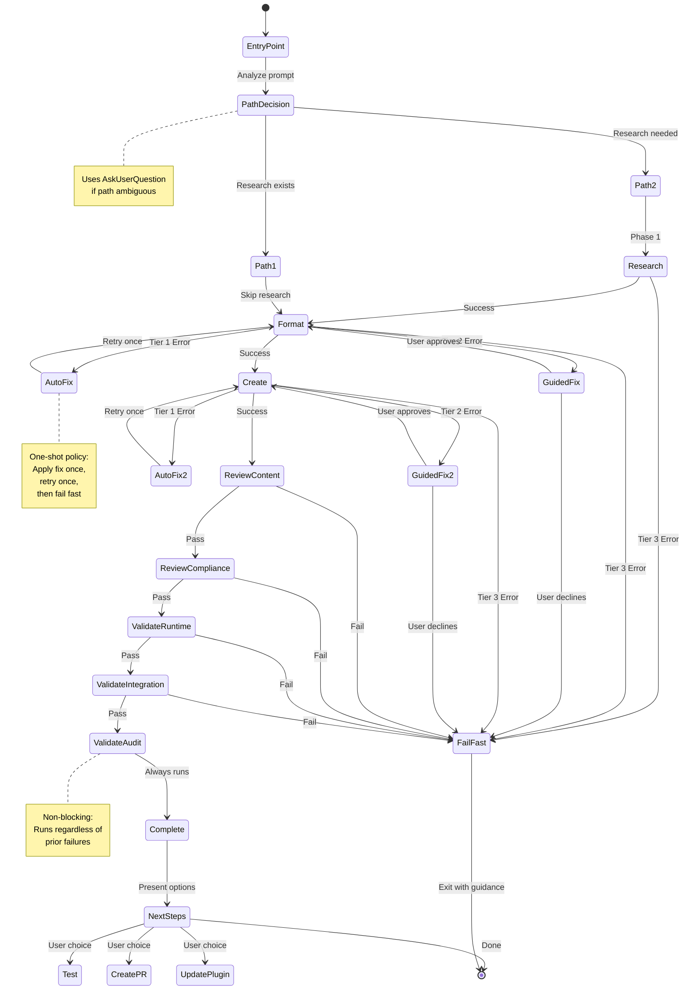
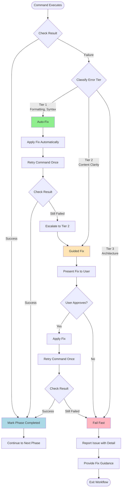

# Skill-Factory Visual Guide

Visual decision trees and workflow diagrams for the skill-factory orchestrator.

---

## How to Use This Guide

- **New to skill-factory?** Start with "Decision Tree: Full Workflow vs Individual Commands"
- **Understanding the workflow?** Study the "Workflow State Diagram"
- **Quick reference?** Check the "Command Decision Matrix"
- **Troubleshooting?** Use the "Error Handling Flow"

---

## Decision Tree: Full Workflow vs Individual Commands

This decision tree helps you choose between using the orchestrated workflow or individual slash commands.

```graphviz
digraph skill_factory_decision {
    rankdir=TB;
    node [shape=box, style=rounded];

    start [label="What are you trying to do?", shape=diamond, style="filled", fillcolor=lightblue];

    new_skill [label="Creating a\nnew skill?", shape=diamond];
    have_research [label="Research\nalready gathered?", shape=diamond];
    specific_issue [label="Fixing a\nspecific issue?", shape=diamond];
    which_phase [label="Which phase\nhas the issue?", shape=diamond];

    full_workflow_research [label="Use Full Workflow\n(Path 2)\n\nskill-factory <name>\n\n✓ Includes research\n✓ 8-phase validation\n✓ Progress tracking", shape=rect, style="filled", fillcolor=lightgreen];

    full_workflow_skip [label="Use Full Workflow\n(Path 1)\n\nskill-factory <name> <research-path>\n\n✓ Skips research phase\n✓ Full 7-phase validation\n✓ TodoWrite progress tracking", shape=rect, style="filled", fillcolor=lightgreen];

    research_cmd [label="/meta-claude:skill:research\n\nAutomate firecrawl scraping\nfor skill domain knowledge", shape=rect, style="filled", fillcolor=lightyellow];

    format_cmd [label="/meta-claude:skill:format\n\nClean and structure\nraw research materials", shape=rect, style="filled", fillcolor=lightyellow];

    create_cmd [label="/meta-claude:skill:create\n\nGenerate SKILL.md with\nYAML frontmatter", shape=rect, style="filled", fillcolor=lightyellow];

    review_content_cmd [label="/meta-claude:skill:review-content\n\nValidate content quality\nand clarity", shape=rect, style="filled", fillcolor=lightyellow];

    review_compliance_cmd [label="/meta-claude:skill:review-compliance\n\nRun quick_validate.py on\nSKILL.md", shape=rect, style="filled", fillcolor=lightyellow];

    validate_runtime_cmd [label="/meta-claude:skill:validate-runtime\n\nTest skill loading\nin Claude context", shape=rect, style="filled", fillcolor=lightyellow];

    validate_integration_cmd [label="/meta-claude:skill:validate-integration\n\nCheck for conflicts with\nexisting skills", shape=rect, style="filled", fillcolor=lightyellow];

    validate_audit_cmd [label="/meta-claude:skill:validate-audit\n\nInvoke claude-skill-auditor\nfor comprehensive audit", shape=rect, style="filled", fillcolor=lightyellow];

    start -> new_skill;

    new_skill -> have_research [label="Yes"];
    new_skill -> specific_issue [label="No"];

    have_research -> full_workflow_skip [label="Yes\nHave research at\nspecific path"];
    have_research -> full_workflow_research [label="No\nNeed to gather\nresearch"];

    specific_issue -> which_phase [label="Yes"];
    specific_issue -> full_workflow_research [label="No\nUse full workflow"];

    which_phase -> research_cmd [label="Research gathering"];
    which_phase -> format_cmd [label="Research formatting"];
    which_phase -> create_cmd [label="Skill generation"];
    which_phase -> review_content_cmd [label="Content quality"];
    which_phase -> review_compliance_cmd [label="YAML/compliance"];
    which_phase -> validate_runtime_cmd [label="Skill won't load"];
    which_phase -> validate_integration_cmd [label="Name conflicts"];
    which_phase -> validate_audit_cmd [label="Anthropic spec audit"];
}
```



### Decision Tree Key Points

**Critical Rule**: For new skills, use the **full workflow** (orchestrated). For specific fixes,
use **individual commands**.

**Decision Flow**:

1. **Creating new skill?**
   - Yes → Check if research exists
     - Research exists → Full Workflow (Path 1)
     - Research needed → Full Workflow (Path 2)
   - No → Check if fixing specific issue
2. **Fixing specific issue?**
   - Yes → Use individual command for that phase
   - No → Use full workflow

**Remember**: Individual commands are power user tools. Most users should use the full orchestrated workflow.

---

## Workflow State Diagram

Shows the phases and state transitions during skill creation.



### State Diagram Key Points

**Entry Point Detection**:

- Analyzes user prompt
- Uses AskUserQuestion if ambiguous
- Routes to Path 1 (skip research) or Path 2 (include research)

**Error Handling States**:

- **AutoFix**: Tier 1 errors (formatting, syntax) - automated fix
- **GuidedFix**: Tier 2 errors (content clarity) - user approval required
- **FailFast**: Tier 3 errors (architectural) - exit immediately

**Quality Gates**:

- ReviewContent must pass before ReviewCompliance
- ReviewCompliance must pass before ValidateRuntime
- ValidateRuntime must pass before ValidateIntegration
- ValidateAudit always runs (non-blocking feedback)

---

## Command Decision Matrix

Quick reference for choosing the right command.

| Scenario | Command | Why | Phase |
|----------|---------|-----|-------|
| **Need web research** | `/meta-claude:skill:research` | Automated firecrawl scraping | 1 |
| **Have messy research** | `/meta-claude:skill:format` | Clean markdown formatting | 2 |
| **Ready to generate SKILL.md** | `/meta-claude:skill:create` | Creates structure with YAML | 3 |
| **Content unclear** | `/meta-claude:skill:review-content` | Quality gate before compliance | 4 |
| **Check frontmatter** | `/meta-claude:skill:review-compliance` | Runs quick_validate.py | 5 |
| **Skill won't load** | `/meta-claude:skill:validate-runtime` | Tests actual loading | 6 |
| **Worried about conflicts** | `/meta-claude:skill:validate-integration` | Checks existing skills | 7 |
| **Want Anthropic audit** | `/meta-claude:skill:validate-audit` | Runs claude-skill-auditor | 8 |

**Phase numbers** show the sequential order in the full workflow.

---

## Error Handling Flow

Visual representation of the three-tier fix strategy.



### Error Handling Key Points

**Tier 1 (Auto-Fix)**: Formatting errors, YAML syntax, markdown issues

- **Action**: Apply fix automatically
- **Retry**: Once
- **Escalation**: If still fails → Tier 2

**Tier 2 (Guided-Fix)**: Content clarity, instruction rewording

- **Action**: Present suggested fix to user
- **User Choice**: Approve or decline
- **Retry**: Once if approved
- **Escalation**: If still fails or user declines → Tier 3

**Tier 3 (Fail-Fast)**: Architectural problems, schema violations

- **Action**: Report issue with detailed explanation
- **Recovery**: Exit immediately with guidance
- **Manual**: User must fix manually

**One-Shot Policy**: Each tier gets one fix attempt, one retry, then escalates or fails. Prevents infinite loops.

---

## TodoWrite Progress Visualization

Shows how TodoWrite tracks progress through the workflow.

```mermaid
gantt
    title Skill-Factory Progress Tracking (Path 2 - Full Workflow)
    dateFormat X
    axisFormat %s

    section Research
    Research skill domain           :done, phase1, 0, 1

    section Format
    Format research materials       :active, phase2, 1, 2

    section Create
    Create skill structure          :phase3, 2, 3

    section Review
    Review content quality          :phase4, 3, 4
    Review technical compliance     :phase5, 4, 5

    section Validate
    Validate runtime loading        :phase6, 5, 6
    Validate integration            :phase7, 6, 7

    section Audit
    Run comprehensive audit         :phase8, 7, 8

    section Complete
    Complete workflow               :phase9, 8, 9
```



**Status Indicators**:

- **Green** (done): Phase completed successfully
- **Blue** (active): Phase currently in progress
- **Gray** (pending): Phase not yet started

**TodoWrite Example** (Phase 2 in progress):

```javascript
[
  {"content": "Research skill domain", "status": "completed", "activeForm": "Researching skill domain"},
  {"content": "Format research materials", "status": "in_progress", "activeForm": "Formatting research materials"},
  {"content": "Create skill structure", "status": "pending", "activeForm": "Creating skill structure"},
  {"content": "Review content quality", "status": "pending", "activeForm": "Reviewing content quality"},
  {"content": "Review technical compliance", "status": "pending", "activeForm": "Reviewing technical compliance"},
  {"content": "Validate runtime loading", "status": "pending", "activeForm": "Validating runtime loading"},
  {"content": "Validate integration", "status": "pending", "activeForm": "Validating integration"},
  {"content": "Run comprehensive audit", "status": "pending", "activeForm": "Running comprehensive audit"},
  {"content": "Complete workflow", "status": "pending", "activeForm": "Completing workflow"}
]
```

---

## Best Practices

### When to Use Visual Guides

- **New users**: Start with Decision Tree to understand full workflow vs individual commands
- **Debugging**: Use Error Handling Flow to understand fix strategies
- **Learning**: Study Workflow State Diagram to understand phase transitions
- **Quick reference**: Use Command Decision Matrix for fast lookup

### Composition Pattern

This visual guide follows the same pattern as **multi-agent-composition/workflows/decision-tree.md**:

- Multiple visual formats (Graphviz, Mermaid, Tables)
- Decision trees with diamond decision nodes
- State diagrams showing transitions
- Quick reference matrices
- Best practices sections

---

**Document Status:** Complete Visual Guide
**Pattern Source:** multi-agent-composition/workflows/decision-tree.md
**Last Updated:** 2025-11-17
